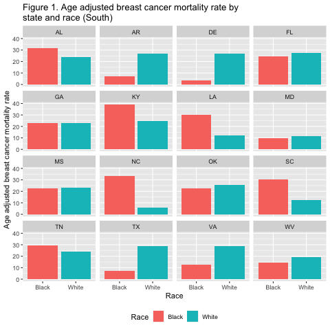
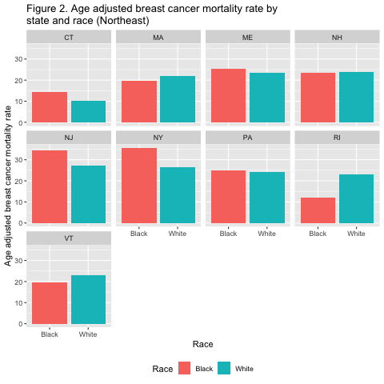
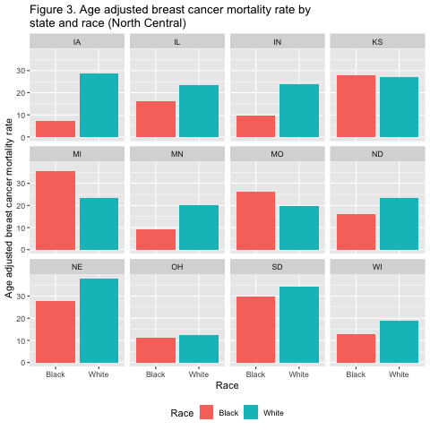
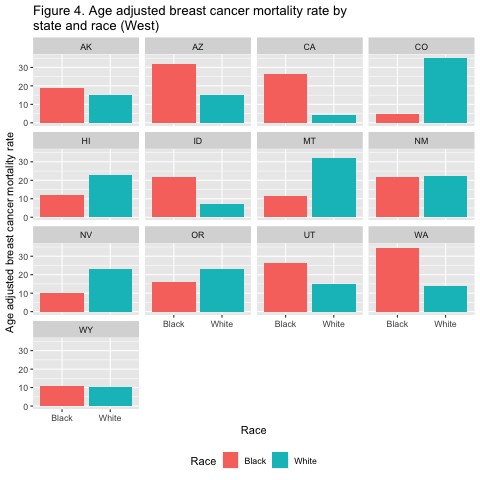

```{r, setupfile, include=FALSE}
knitr::opts_chunk$set(
  echo = FALSE, warning = FALSE, message=FALSE, dpi=300, out.width="500",out.height="500",fig.align = "center"
)
```

## Introduction
This document looks at breast cancer age adjusted mortality rates in non-Hispanic women between 2003 and 2017. We specifically compare mortality rates among non-Hispanic white women and non-Hispanic Black women on the state level. In order to make the output easier to evaluate, tables and figures are grouped by region (as defined by the United States Census Bureau). Breast cancer age-adjusted mortality rates were extracted from SEER and calculated using standardized populations from the United States Census Bureau. Note that all data has been scrambled or replaced with simulated values so that this can be publicly viewed.

```{r, load_ds_and_package,message=FALSE}
#NOTE: packages must be installed in R before being loaded below. See README.md file for instructions

#load packages
suppressMessages(library(tidyverse))
suppressMessages(library(magrittr))
suppressMessages(library(kableExtra))
suppressMessages(library(ggplot2))
suppressMessages(library (readr))


#read in table and figure clean data
suppressMessages(ds2_fig<-read_csv("../clean_data/ds2_fig.csv",col_names=TRUE))
suppressMessages(all2<-read_csv("../clean_data/all2.csv",col_names=TRUE))
```

```{r, loadfunction}
#load table function
source("../R/03a_create_gettblfunction.R")
```
<!--format spacing in html doc-->
<div style="margin-bottom:240px;"> 
## Region: South
```{r,gettbl}
gettbl(r="South",c="1")

#get max and min for text
south<-subset(all2, region=="South")
south$diff<-abs(south$Black-south$White)

s.max<-south$State[south$diff==max(south$diff)]
s.min<-south$State[south$diff==min(south$diff)]
```


We see that age adjusted breast cancer mortality rates vary by race in Southern states (Table 1). These disparities are greatest in `r s.max` and smallest in `r s.min` (shown in Table 1 and Figure 1).


```{r, getsplot,dpi=300}



```
</div>
<!--format spacing in html doc-->
<div style="margin-bottom:160px;"> 
## Region: Northeast
```{r, netbl}
gettbl(r="Northeast",c="2")

#get max and min for text
ne<-subset(all2, region=="Northeast" & !is.na(Black))
ne$diff<-abs(ne$Black-ne$White)

ne.max<-ne$State[ne$diff==max(ne$diff)]
ne.min<-ne$State[ne$diff==min(ne$diff)]
```


We see that age adjusted breast cancer mortality rates vary by race in Northeastern states as well (Table 2). These disparities are greatest in `r ne.max` and smallest in `r ne.min` (shown in Table 2 and Figure 2).

```{r,nefig}

```
 <!--format spacing in html doc-->
<div style="margin-bottom:140px;">
## Region: North Central
```{r, nctbl}
gettbl(r="North Central",c="3")

#get max and min for text
nc<-subset(all2, region=="North Central" & !is.na(Black))
nc$diff<-abs(nc$Black-nc$White)

nc.max<-nc$State[nc$diff==max(nc$diff)]
nc.min<-nc$State[nc$diff==min(nc$diff)]
```


We see that age adjusted breast cancer mortality rates vary by race in the North Central region (Table 3). These disparities are greatest in `r nc.max` and smallest in `r nc.min` (shown in Table 3 and Figure 3).

```{r,ncfig}

```
</div>
<!--format spacing in html doc-->
<div style="margin-bottom:200px;"> 
## Region: West
```{r, wtbl}
gettbl(r="West",c="4")

#get max and min for text
w<-subset(all2, region=="West" & !is.na(Black))
w$diff<-abs(w$Black-w$White)

w.max<-w$State[w$diff==max(w$diff)]
w.min<-w$State[w$diff==min(w$diff)]
```


We see that age adjusted breast cancer mortality rates vary by race in the Western region as well (Table 4). These disparities are greatest in `r w.max` and smallest in `r w.min` (shown in Table 4 and Figure 4).

```{r,wfig}

```


